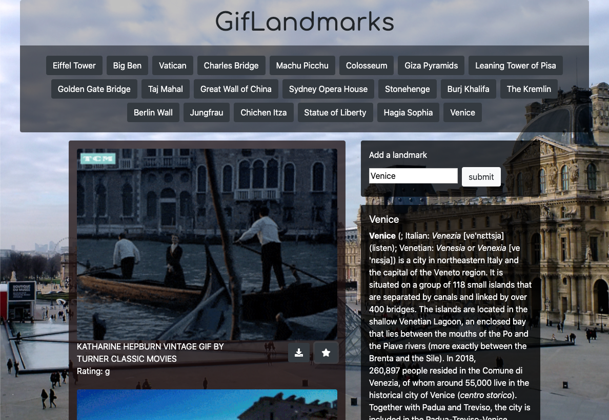

# GifTastic

## Overview
Deployed at: https://lukeevangraham.github.io/GifTastic/

With this app, I used the GIPHY API to make a dynamic web page that populates with travel-based gifs.

## Using the app

Near the top of the screen the app generates buttons (from an array of strings).

When a user clicks on a button, the page grabs 10 static, non-animated gif images from the GIPHY API and places them on the page.
When a user clicks one of the still GIPHY images, the gif animates. If a user clicks the gif again, it stops playing.

Under every gif, its rating is displayed (PG, G, so on).

This data is provided by the GIPHY API.

A form on the right side of the page takes user input and adds it to the buttons at the top of the page.
